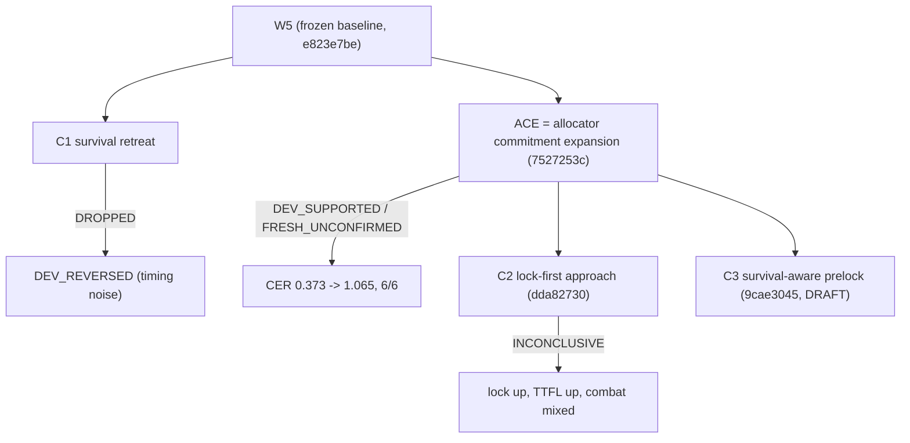

# Version Lineage



```
W5 (frozen)
├── C1 survival retreat ................ DROPPED
└── ACE allocator expansion ............ DEV_SUPPORTED / FRESH_UNCONFIRMED
    ├── C2 lock-first approach ......... INCONCLUSIVE
    └── C3 survival-aware prelock ...... DRAFT (diagnosis done, validation incomplete)
```
