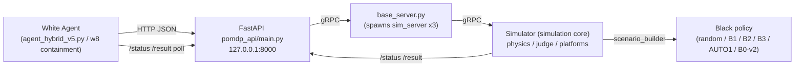

# 01 — System Architecture

## 1. Runtime topology

- Services started by `/tmp/opencode/start_services.sh`: `base_server.py --simserver_num 3` then `pomdp_api/main.py`.
- White agent talks HTTP to `:8000` (`ApiClient` in `agent_hybrid_v5.py`); API talks gRPC to sim servers (registered on ports 6000+).
- Per-episode config is written to `/tmp/opencode/rw_cfg.txt` (seed, counts, movement mode, profile in the 7th field).

## 2. White agent data path
- Observation: `GET /status` → `资源快照.单位状态.white_usv_states/white_uav_states` (own state),
  `资源快照.观察信息.white_observation.雷达捕获` (legal enemy intel).
- Decision: `TrackManager` → `ThreatAllocator.allocate_usvs` (WHO/WHAT/TARGET) →
  `USVController` / `UAVManager` (HOW) → `ActionSafety`.
- Action: HTTP commands to `:8000` (`cmd_sail_area`, `cmd_lock`, …).
- Logging: step summaries + `[DETECT]/[ASSIGN]/[RELEASE]/[KILL]` + `[META]` to the episode `.log`.

## 3. Black policy path (inside the simulator process)
- `scenario_builder.build_scenario` selects initial Black waypoints and (optionally) a runtime controller:
  - B0-v1: `_random_waypoint_paths(seed, ys)`, speed 10 (default).
  - B0-v2: same waypoints + `opponent_b0_v2.sample_speed(seed)` (Uniform 5–10 m/s).
  - B1/B2/B3: `opponent_profiles.generate_initial_paths(...)`; B3 additionally registers
    `B3AdaptiveController` (legal-observation adaptive replanning).
  - AUTO1: `opponent_auto_profiles.generate_initial_paths_auto(...)` + `FeintSwitchController`
    (phased feint→switch→main push).
- Black uses ONLY legal observation: `engine.get_black_targets()` + own unit state; UAV is recon-only.

## 4. Strategy Library & Policy System
- SQLite `strategy_library/strategy_library.db` tables: `strategies`, `policy_cards`,
  `policy_artifacts`, `policy_fingerprints`, `policy_validations`.
- FastAPI router `strategy_library/policy_router.py` mounted in `pomdp_api/main.py`:
  `/policies/{id}`, `/artifact`, `/fingerprints`, `/fingerprint/latest`, `/compare/{other}`, `/seal`.
- Fingerprints: fp-v1 (legacy 93-ep for B0/B3) and fp-v2 (S2×10 common calibration);
  fp-v3 structural features (phase/reserve/axis) used for AUTO1 (see 04/06).

## 5. Auto Harness evolution loop

```mermaid
flowchart LR
  C["Discovery corpus\n(W5 x B3, 6001-6100)"] --> M["Failure Miner v2\n(duration-normalized + taxonomy)"]
  M --> T["Targets\nF-LEAK / F-ATTRITION"]
  T --> D["Candidate design\n(allocator overlay only)"]
  D --> U["Unit / fair-play / W5-equivalence"]
  U --> R["Offline mechanism replay"]
  R --> DEV["Paired DEV tournament"]
  DEV --> F["Fresh validation"]
  F --> X["Cross-opponent generalization"]
  X --> P["Promotion / Strategy Library"]
```

## 6. Key files
| area | files |
|---|---|
| White | `agent_hybrid_v5.py`, `agent_hybrid_w6.py`, `agent_hybrid_w8_containment.py` |
| Black | `opponent_profiles.py`, `opponent_auto_profiles.py`, `opponent_b0_v2.py`, `hsystem/sim_script/20250819TZB/scenario_builder.py` |
| Policy system | `strategy_library/*.py`, `strategy_library/strategy_library.db` |
| Harness | `auto_harness/phase0/`, `auto_harness/phase1/` |
| Runners | `run_opponent_formal.py`, `common_policy_calibration.py`, `auto_opponent_calibration.py`, `run_white_phase1.py`, `run_b0_v2.py`, `run_replay_set.py` |
